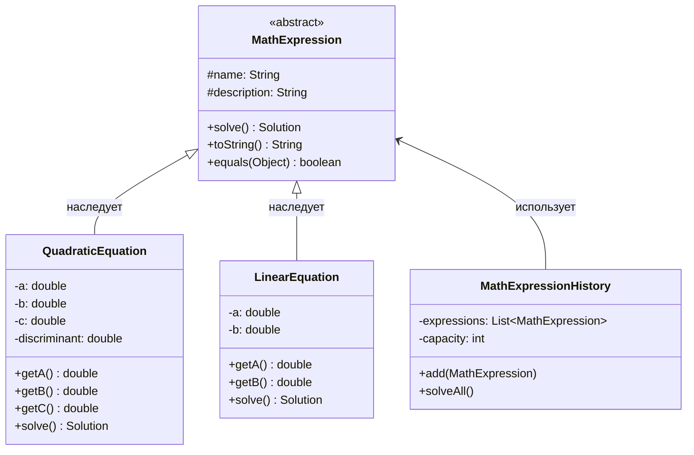

# Система решения математических уравнений

## Описание предметной области
Система предназначена для решения линейных и квадратных математических уравнений.
Позволяет хранить историю вычислений.

## Основные сущности
- **MathExpression** - абстрактный класс для всех математических выражений
- **LinearEquation** - линейные уравнения ax + b = 0
- **QuadraticEquation** - квадратные уравнения ax^2 + bx + c = 0
- **MathExpressionHistory** - история решенных выражений
- **DeveloperInfo** - информация о разработчике
- **ProgramInfo** - информация о программе
- **Solution** - представление результата вычисления

